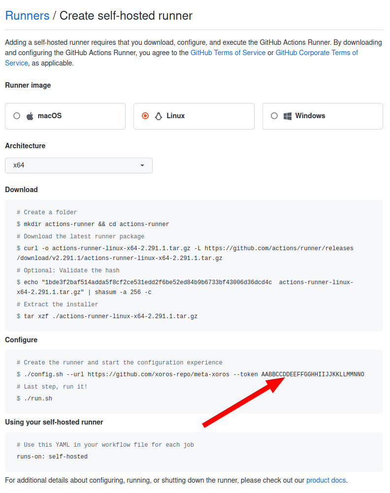

# Xoros Builder

Xoros Builder is a pre-configured building environment docker image specifically tuned to build Xoros.
The builder image also has GitHub Actions runner installed to be used in conjunction with GitHub actions CI workflow.

## Create builder

### 1. Obtain code

```shell
git clone https://github.com/xoros-repo/xoros-builder.git
```

### 2. Build locally

```shell
docker build xoros-builder --tag=ghcr.io/xoros-repo/xoros-builder:latest
```

## Configure and launch GitHub actions runner

#### 0. Navigate to `xoros-builder` directory

```shell
cd xoros-builder
```

#### 1. Modify or create your .env file

Example `.env` file:

```dotenv
GITHUB_RUNNER_REPO=xoros-repo/meta-xoros
GITHUB_RUNNER_TOKEN=AABBCCDDEEFFGGHHIIJJKKLLMMNNO
```

To get your GitHub runner token, go to repository Settings -> Actions -> Runners -> New self-hosted runner.
Please 

> 

#### 2. Launch using docker-compose

```shell
docker-compose --env-file .env up -d --remove-orphans
```

OR

```shell
ci/deploy.sh detach
```

#### PS. Notes regarding GitHub runner operation

GitHub runner is launched, configured and shutdown by runner script helper `github-runner.sh`.

1. Upon every start, the runner script will connect to GitHub repo and create a new runner under `Settings -> General -> Actions -> Runners`. Example: https://github.com/xoros-repo/meta-xoros/settings/actions/runners
2. Runner script will remove created runner automatically (if it was gracefully shutdown)
