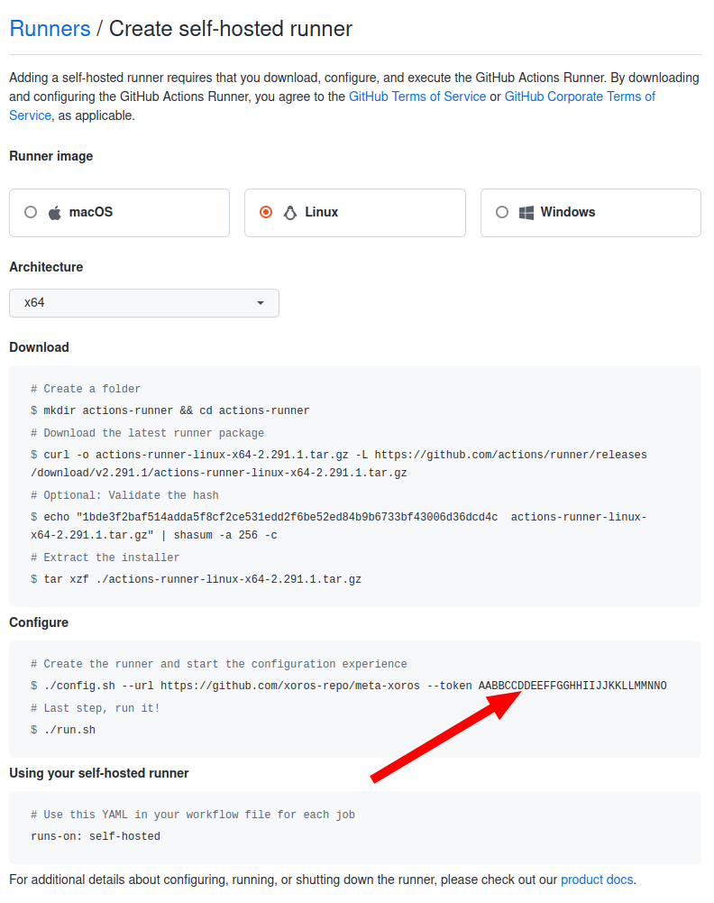

# Xoros Builder

## Docker Image

###  Running image using docker-compose

#### 1. Modify your .env file

To get your Github runner token, go to repository Settings -> Actions -> Runners -> New self-hosted runner.



```dotenv
GITHUB_REPO=xoros-repo/meta-xoros
GITHUB_RUNNER_TOKEN=AABBCCDDEEFFGGHHIIJJKKLLMMNNO
```

#### 2. Launch docker-compose

```shell
docker-compose --env-file .env up -d --remove-orphans
```
